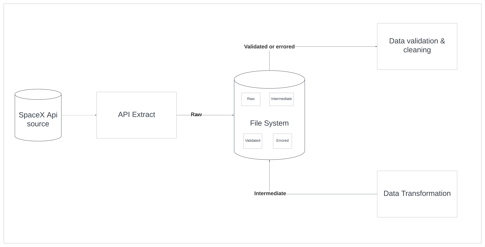

# Spacex API Data Pipeline

## Description

This project is to build a data pipeline that receives spacex launch data through an API, process it and stores it in a database.

## Features

- Data ingestion
- Data processing [validation, transformation]
- Data Loading [loading of data into a database in batches]

## Technology Stack

 - Python: Version 3.11
 - Pydantic: Version 2.3.0
 - SQLAlchemy: Version 2.0.20
 - Alembic: Version 1.11.3
 - Postgres Version 15.3

## Considerations & assumptions

There are various considerations at different stages while building a data pipeline such as:
- Bounded vs Unbounded [Bucketing data]
- Frequency [Batch, Micro-batch, read-time]
- Synchronous vs Asynchronous [Dependency of processes in data pipeline]
- Serialization & Deserialization
- Push vs pull pattern [Ingestion patterns]
- Data modeling
- Stream vs batch transformation
- Storage

For the simplicity of this project, the following are built in ETL format:
[pull, batch, bounded, asynchronous, batch transformation, postgres]
- Data ingestion: The data is ingested from an API and stored in a local file system as raw format.
- Data processing: The data is validated and split into validated folder and errored for conditions on contract failure and transformed to the target table structure and stores in intermediate folder.
- Data Loading: The data is loaded into a database in batches.
- src/core/data_pipeline has the code for the above-mentioned steps. 
- **The code is as modular as possible to make it easy to extend and maintain. I have avoided external frameworks like airflow, dagster or airbyte and tried to create a simple dag dependency structure.**



## How to run the project

1. Clone this repository 
```https://github.com/haripkrish/spacex```
2. Run the docker build command to build image of the project
```docker build -t spacex .```
3. Run the docker compose command to run the project
```docker-compose up --build --force-recreate --renew-anon-volumes```


## Improvements

- Provide configurable options for the jobs
- Add orchestration tool to manage the jobs
- Build a system to handle failures
- Have good test coverage
- Observe the application using prometheus and grafana 


